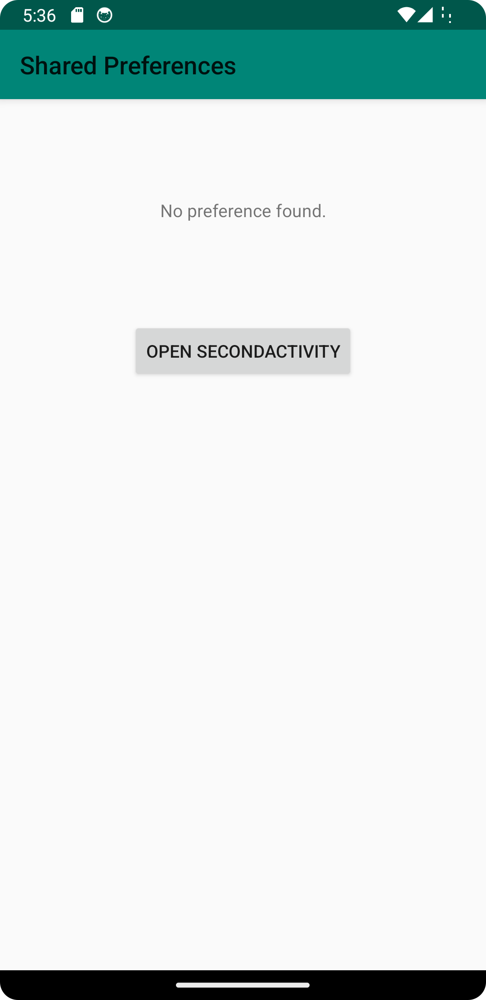
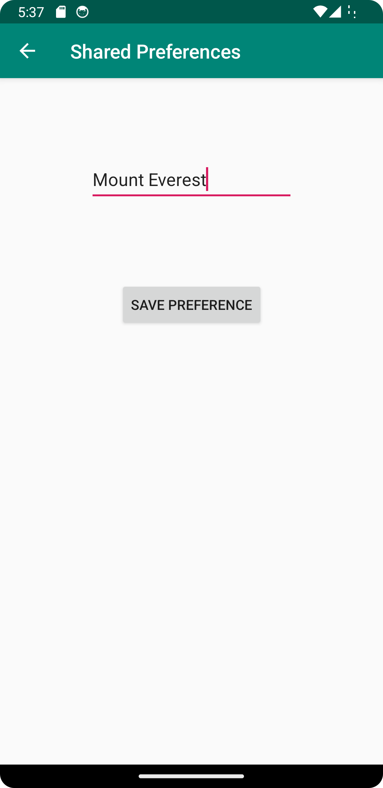

# Rapport

**SharedPreferences**

```
...
Button button = findViewById(R.id.openSecondActivityButton);
button.setOnClickListener(new View.OnClickListener() {
    @Override
    public void onClick(View view) {
        Intent intent = new Intent(MainActivity.this, SecondActivity.class);
        startActivity(intent);
    }
});
...
```
När knappen har klickats kommer den att starta en andra aktivitet.

```
...
public class SecondActivity extends AppCompatActivity {
    private SharedPreferences.Editor myPreferenceEditor;

    @Override
    protected void onCreate(Bundle savedInstanceState) {
        super.onCreate(savedInstanceState);
        setContentView(R.layout.activity_second);

        SharedPreferences myPreferenceRef = getSharedPreferences("preference", MODE_PRIVATE);
        myPreferenceEditor = myPreferenceRef.edit();

        ...
    }
}
```
I andra aktiviteten finns SharedPreferences som är privat och kan modifieras

```
...
Button button = findViewById(R.id.save_preference);
button.setOnClickListener(new View.OnClickListener() {
    @Override
    public void onClick(View view) {

        // Grab edit view id
        EditText editText = findViewById(R.id.editText);

        // add string value and commit.
        myPreferenceEditor.putString("data1", editText.getText().toString());
        myPreferenceEditor.commit();
        finish();
    }
});
...
```
Koden hämtar EditText id och sedan sätts värdet på PreferenceEditor och sedan commitas det.

```
...
@Override
protected void onResume() {
    super.onResume();

    SharedPreferences myPreferenceRef = getSharedPreferences("preference", MODE_PRIVATE);

    // Grab textview id
    TextView prefTextRef = findViewById(R.id.preferenceText);

    // trying to find preference data and if data was found then print value on textView otherwise print "No preference found".
    prefTextRef.setText(myPreferenceRef.getString("data1", "No preference found."));
}
```
När den har commit kommer köras onResume-metoden, vilket hämtar TextView id och försöker hitta preferensdata som sätter värdet på det.
Om data hittas kommer värdet att sättas på TextView, annars skrivs "Ingen preferens hittad" ut.


Här visas hur appen ser ut från början när det inte finns någon sparad data.


Detta visar grafisk där användaren kan skriva text i EditText och sedan klicka på knappen.


Efter att knappen har klickats visas värdet på skärmen.

Läs gärna:

- Boulos, M.N.K., Warren, J., Gong, J. & Yue, P. (2010) Web GIS in practice VIII: HTML5 and the canvas element for interactive online mapping. International journal of health geographics 9, 14. Shin, Y. &
- Wunsche, B.C. (2013) A smartphone-based golf simulation exercise game for supporting arthritis patients. 2013 28th International Conference of Image and Vision Computing New Zealand (IVCNZ), IEEE, pp. 459–464.
- Wohlin, C., Runeson, P., Höst, M., Ohlsson, M.C., Regnell, B., Wesslén, A. (2012) Experimentation in Software Engineering, Berlin, Heidelberg: Springer Berlin Heidelberg.
